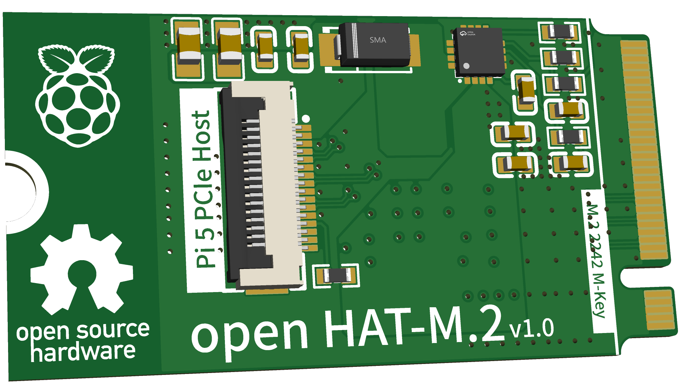

# open-HAT-M.2

A boring board, converting the Raspberry Pi 5's PCIe HAT into a M.2 M-Key 2242 card.

Just like project [open-HAT-PCIe](https://github.com/tltangliang/open-HAT-PCIe), I made another one for M.2 M-key.

## Features
- Convert Pi 5 PCIe/NVMe HAT to M.2 M-Key 2242 card
- Compatible with Pi 5 PCIe HAT
- Compatible with M.2 M-Key PCIe x1 Gen 2
- Compatible with M.2 2242

## OSHWA

## SCH

## PCB

